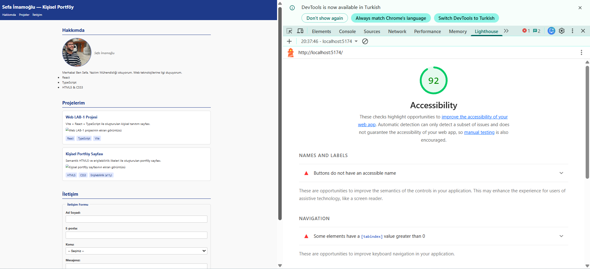

# 🌐 Web LAB-1 & LAB-2 — Kişisel Portföy Projesi

## 📋 Hakkında
Bu proje, **Web Tasarımı ve Programlama** dersi LAB-1 ve LAB-2 kapsamında
**Vite + React + TypeScript** kullanılarak oluşturulmuştur.

- **LAB-1:** Geliştirme ortamı kurulumu, Vite + React + TypeScript projesi, Git iş akışı
- **LAB-2:** Semantik HTML5, Erişilebilirlik (a11y), Form yapıları, Lighthouse testi

---

## 👤 Geliştirici
| Alan | Bilgi |
|---|---|
| **Ad Soyad** | Sefa İMAMOĞLU |
| **Öğrenci No** | 230541038 |
| **Bölüm** | Yazılım Mühendisliği |

---

## 🛠️ Kullanılan Teknolojiler
- ⚛️ React 18
- 🔷 TypeScript
- ⚡ Vite
- 🏗️ Semantik HTML5
- 🎨 CSS3

---

## 🚀 Kurulum ve Çalıştırma

```bash
npm install
npm run dev
```

Tarayıcıda `http://localhost:5173` adresini aç.

---

## 📁 Proje Yapısı
```
web-lab-hello/
├── src/
│   ├── App.tsx       ← Ana portföy bileşeni
│   └── index.css     ← Sayfa stilleri
├── public/
│   ├── sefa.jpeg     ← Profil fotoğrafı
│   └── lighthouse.png ← Lighthouse raporu
└── index.html
```

---

## ♿ Lighthouse Erişilebilirlik Testi (LAB-2)

**Accessibility Puanı: 92 / 100** ✅



