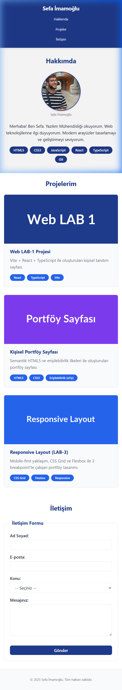
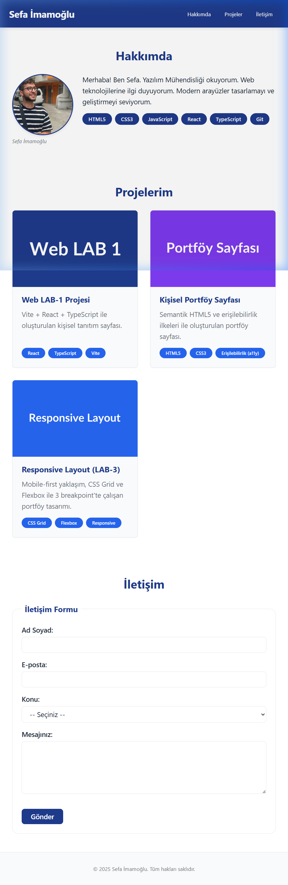
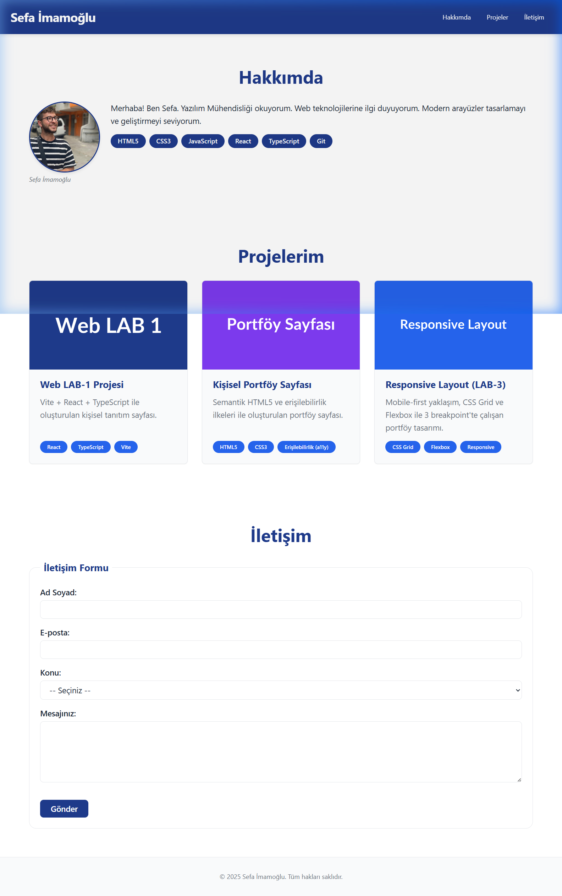

# Web LAB Projesi (LAB-1 → LAB-4)

Web Tasarımı ve Programlama dersi kapsamında geliştirdiğim proje. Vite + React + TypeScript ile başladım, her lab'da yeni bir şey ekledim.

## Geliştirici

**Sefa İMAMOĞLU** — 230541038 — Yazılım Mühendisliği

---

## Lablar

| Lab | Ne yaptım |
|-----|-----------|
| LAB-1 | Vite + React + TypeScript kurulumu, Git ile versiyon kontrolü |
| LAB-2 | Semantik HTML, erişilebilirlik (a11y), form yapıları, Lighthouse testi |
| LAB-3 | Mobile-first tasarım, Flexbox & Grid, Design Tokens, `clamp()` ile fluid typography |
| LAB-4 | Tailwind CSS v4 entegrasyonu, Button/Input/Card/Alert bileşenleri, dark mode, UI Kit sayfası |

---

## Kullanılan Teknolojiler

- React 19, TypeScript, Vite
- Semantik HTML5, CSS3 (Flexbox, Grid, Custom Properties)
- Tailwind CSS v4
- Mobile-first responsive tasarım

---

## Çalıştırmak için

```bash
npm install
npm run dev
```

`http://localhost:5173` adresine git.

---

## Proje yapısı

```
src/
├── components/
│   ├── Button.tsx
│   ├── Input.tsx
│   ├── Card.tsx
│   └── Alert.tsx
├── pages/
│   └── UIKit.tsx
├── App.tsx
└── index.css
```

---

## Lighthouse Erişilebilirlik Skoru (LAB-2)

**92 / 100**


---

## Ekran Görüntüleri (LAB-3)

| Mobil (375px) | Tablet (768px) | Masaüstü (1280px) |
|:---:|:---:|:---:|
|  |  |  |

---

## UI Bileşenleri (LAB-4)

Sayfadaki **UI Kit** butonuna tıklayarak bileşenleri canlı görebilirsin.

| Bileşen | Varyantlar |
|---------|------------|
| `Button` | primary, secondary, danger, ghost / sm, md, lg |
| `Input` | normal, error, helpText, disabled |
| `Card` | elevated, outlined, filled |
| `Alert` | info, success, warning, error, dismissible |
