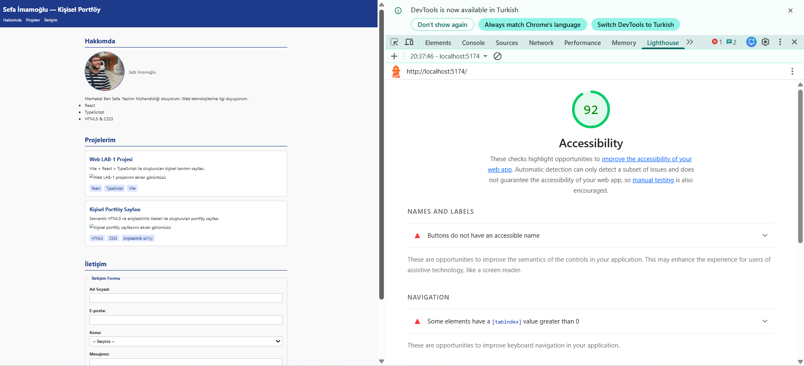

# Web LAB Projesi (LAB-1 → LAB-5)

Web Tasarımı ve Programlama dersi kapsamında geliştirdiğim kişisel portföy projesi.  
Vite + React + TypeScript altyapısıyla başladı, her lab'da yeni bir katman eklendi.

## Geliştirici

**Sefa İMAMOĞLU** — 230541038 — Yazılım Mühendisliği

---

## Lab Özeti

| Lab | Konu | Ne Yaptım |
|-----|------|-----------|
| **LAB-1** | Ortam Kurulumu | Vite + React + TypeScript kurulumu, Git ile versiyon kontrolü |
| **LAB-2** | Semantik HTML & Erişilebilirlik | Semantik HTML5 yapısı, a11y, form, Lighthouse skoru 92/100 |
| **LAB-3** | Responsive CSS | Mobile-first tasarım, Flexbox & Grid, Design Tokens, `clamp()` fluid typography |
| **LAB-4** | Tailwind CSS & UI Kit | Tailwind v4 entegrasyonu, Button/Input/Card/Alert bileşenleri, dark mode |
| **LAB-5** | JavaScript/TypeScript & State | Fetch API, async/await, TypeScript tipleri, state yönetimi, filtreleme & sıralama |

---

## Kullanılan Teknolojiler

- **React 19** + **TypeScript** + **Vite**
- **Tailwind CSS v4** — dark mode desteği
- **Semantik HTML5**, CSS3 (Flexbox, Grid, Custom Properties)
- **ES Modules**, async/await, Fetch API
- Mobile-first responsive tasarım

---

## Çalıştırmak İçin

```bash
npm install
npm run dev
```

`http://localhost:5173` adresine git.

---

## Proje Yapısı

```
src/
├── components/
│   ├── Button.tsx
│   ├── Input.tsx
│   ├── Card.tsx
│   └── Alert.tsx
├── pages/
│   └── UIKit.tsx
├── services/
│   └── projectService.ts   ← LAB-5: Fetch API servisi
├── types/
│   └── project.ts          ← LAB-5: TypeScript tipleri
├── utils/
│   └── projectHelpers.ts   ← LAB-5: Filtreleme & sıralama
├── App.tsx
└── index.css
public/
└── data/
    └── projects.json       ← LAB-5: Mock proje verisi
```

---

## LAB-5 Öne Çıkan Özellikler

- **JSON'dan dinamik veri çekme** — `fetchProjects()` ile `async/await` + hata yönetimi
- **TypeScript tip güvenliği** — `interface Project`, `type Category`, sıfır `any`
- **State yönetimi** — `useState` + `useEffect`, DOM'a dokunmadan UI güncelleme
- **Arama filtresi** — başlık, açıklama ve teknoloji alanlarında eş zamanlı arama
- **Kategori filtresi** — Frontend / Fullstack / Backend / Tümü
- **Sıralama** — Yıla veya başlığa göre artan/azalan

---

## Lighthouse Erişilebilirlik Skoru (LAB-2)

**92 / 100**



---

## UI Bileşenleri (LAB-4)

Sayfadaki **UI Kit** butonuna tıklayarak bileşenleri canlı görebilirsin.

| Bileşen | Varyantlar |
|---------|------------|
| `Button` | primary, secondary, danger, ghost · sm, md, lg |
| `Input`  | normal, error, helpText, disabled |
| `Card`   | elevated, outlined, filled |
| `Alert`  | info, success, warning, error, dismissible |

---

## Git Branch Yapısı

```
main
├── feature/tailwindcss-ui-kit    ← LAB-4
└── feature/typescript-projects   ← LAB-5
```
